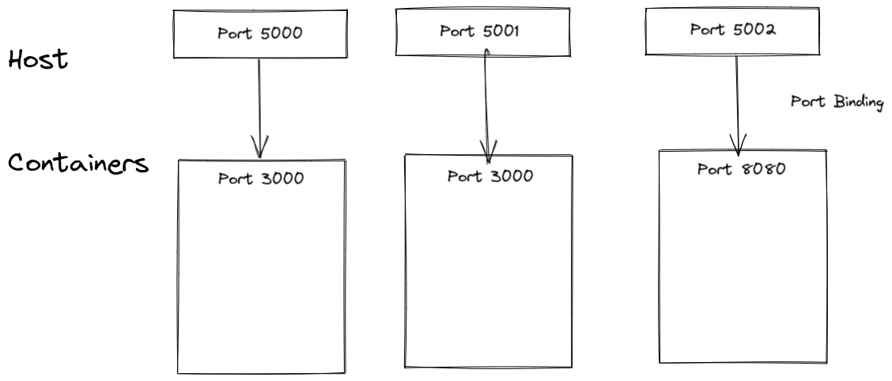

# Ports in Docker

Containers have their own set of virtual ports, just like a physical machine. We can bind host machine's ports with docker ports.



Note that Containers can have same ports

**To bind container port to our machine: `docker container run -p 6000:6379 redis`**

Here, host port 6000 is binded to container port 6379 ****

## Containers Network

If two containers are having same network, they can intercommunicate, but first we need to create a new network

`docker network create nameofnetwork`

Now this network can be used by multiple containers

`docker run ubuntu --net nameofnetwork`

## Everything so Far

```bash
docker run -d\\
	--name mongodb \\
	-p 27017:27127 \\
	-e MONGO_INITDB_ROOT_USERNAME = admin \\
	-e MONGO_INITDB_ROOT_PASSWORD = password \\
	--net mongo-network \\
mongodb

```